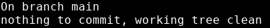

# Git commit
---


Now that we've added a file for git to track, we can make our first commit. 
```bash
git commit -m "first commit, added README.md"
```

Notice the -m option. This stands for __message__. 

Any time we make a commit, we want to give it a descriptive message that tells us whatever new changes have been made since the last time we committed. 

But what is a commit anyway?

Well, if you remember from earlier, commits are like breadcrumbs. So now we have one breadcrumb on our trail. This means that any time we want, we can come back to this version of our project.

This is why descriptive commit messages are important. If we find ourselves trying to figure out where our program went wrong, we need to know what changes happened at each breadcrumb we could go back to.

Let's run our favorite command again:

```bash
git status
```


{: .terminal}

Now our changes have been immortalized in a commit.

---
# Adding vs Committing

Adding and committing are different. 

When we *add* a file, we are placing it in the __index__.

When we *commit*, we are adding everything in the index to the __object database__.
<br>


{: .text-center}

The index is also known as the __staging area__. We can add to the index as many times as we want before committing. The staging area saves our most recent changes, but they're not permanent. Only commits can be revisited in the long term.

Adding to the staging area is a good idea if we have reached a good spot in our project, but we're not ready to make a breadcrumb for us to come back to. Adding to the index often is a good idea. Files in the index can be restored to the working directory, so if we mess something up before we have committed, but we added our last working state to the index, we can get back to it. Think of it as a quicksave feature.

When we commit a file, we are placing it in the object database, aka our __repository__.

We can revisit any of our old commits, no matter how far along we get in our project.

---
# Exercise:
---

- [ ] Create a file called index.html in your repository
- [ ] Copy the code below and paste it into index.html
- [ ] Add index.html to your staging area
- [ ] Make a commit with a descriptive message 
- [ ] ```git commit -m "<my descriptive commit message>"```

Don't forget to include a descriptive message for your commit!

```html
<html lang="en">
<head>
    <meta charset="UTF-8">
    <meta http-equiv="X-UA-Compatible" content="IE=edge">
    <meta name="viewport" content="width=device-width, initial-scale=1.0">
		<link rel="stylesheet" href="style.css"></link>
    <title>Your Name Here</title>
</head>
<body>

<div id="header"><h1>Your Name Here</h1></div>

<div id="skills" class="section">
  <h2>-My Skills-</h2>
  <ul>
    <li></li>
  </ul>
</div>
    
</body>
</html>
```

