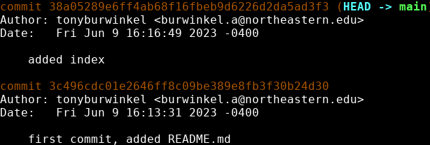

# Git log

---
Now that we have made a few commits, we should take a look at the history of our repository. Git has another command for this:

```bash
git log
```

Git log shows us each commit in our repository history, along with the __hash__ of the commit. 

Git uses a commit's hash to uniquely identify it. 

We can use commit hashes to revisit old commits.


{: .terminal}

Git log uses a pager to display our commit history, so you can use your up and down arrow keys to move up and down once the history gets long. 

Git log also has some useful options we can use to make our history easier to look at:

```bash
git log --oneline
```


{: .terminal}

When you've got a lot of commits and are looking for one in particular, the ```--oneline``` option comes in handy. 

You'll notice the commits in this version of the log have short hashes. These can also be used to go back to a commit.

---

# Workshop goals
- [x] learn what git is and why we should use it
- [x] learn the basic git commands
- [ ] learn branching and merging with git
- [ ] learn git collaboration with GitHub

