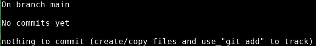
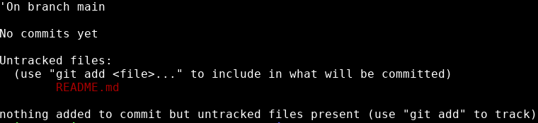

# Git status
---

Anytime we want to see what's going on with git, we can run this command:

```bash
git status
```


{: .terminal }

Git status is a very handy command. It tells us:
* where we are - right now, we're on the main branch
* what we've done - we haven't committed anything yet
* what we can do - we can add files to start tracking them

>Any time you're going to start issuing commands to git, it's a good idea to run git status first. It's a passive command, it doesn't change anything about your directory or repository. Running git status never hurts!
{: .pro-tip}

***

Let's create a README file for our website. Make a new file called README.md and copy the following code into it:

> README.md:
> ```
> # Personal Website
> ```
{: .copy-code}

Now let's run ```git status``` again.



{: .terminal }

---

Now git tells us we have an untracked file. 

What does this mean? 

Well, git only tracks files that we tell it to keep track of. We've started our project by adding the README file, but we haven't told git to start watching it for changes yet. As far as git is concerned, this is still an empty directory. This is one quirk of git, it ignores anything in our folder that we don't specifically tell it about. Until we use our next commmand...