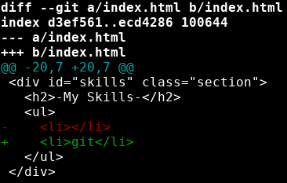
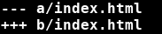
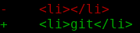

# Git diff
---

Let's make another branch for adding some of our skills to our website.

```bash
git checkout -b add-skills
```

Now let's edit our index.html skills section to include git:

index.html:
```html
...
<div id="skills" class="section">
  <h2>-My Skills-</h2>
  <ul>
    <li>git</li>
  </ul>
</div>
...
```

Add your changes to the staging area using ```git add .```

Now let's try another handy git command, ```git diff```. 

To use git diff, we use the command format ```git diff <target branch>``` 

This compares the branch we are currently on to the target branch. If we want to see the differences between main and our current branch, add-skills, we should run:

```bash
git diff main
```


{: .terminal}

Git gives us a lot to look at here. 

Line 1:


* this tells us the file that is different on the 2 branches
* a is always the target branch, in this case, it's main
* b is the branch we are on, in this case, it's add-skills

Lines 3-4: 


* these lines tell us how to interpret the rest of the output
* lines from branch a (add-skills) will be led with '-'
* lines from branch b (main) will be led with '+'

Lines 9-10



* plus and minus signs here tell us which files these different lines are from
* main branch has the first line
* add-skills has the second line
* git also color codes the lines for us

---
# Exercise
---
- [ ] create a new branch from main 
- [ ] switch to the branch and add to your skills
- [ ] use git diff to compare your new branch to main
- [ ] commit your changes and switch back to main
- [ ] merge your changes into the main branch using git merge