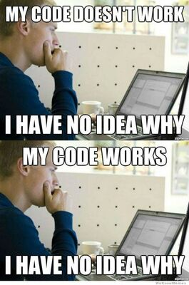

# Why use Git?
---

{: .text-center }
If you haven't been here yet, you will be...

One of the hardest parts of writing software is changing it once it has been written. 
Refactoring code often leads to breakage. Sometimes you start with code that works, but when you try to change it, it breaks. 

Software projects get bigger and more complicated as they get older.

Once a project is a certain size, we need version control to make changes to it without breaking it.

Git gives us a clean way to back-track to older versions of our code that we know work. Every __commit__ you make with git is a point in the development of your program that you can revisit.

These commits last forever (unless we intentionally get rid of them).

Git allows us to keep multiple versions of our code base on different __branches__-- another important git concept we will get to later.

---

# What's the alternative?
---

Can’t I just back all of my code up into a folder? 

Yes, it's true, you could do this. But just imagine how many folders you'd have after a while.

Which one is the oldest? 

Which one includes what changes? 

What if you want to work on your program with someone else? 

Which folder should you share with them? What if you both make changes to the same part of the project? How can you resolve this conflict?

Git gives us a system for keeping track of all of this information and more, and spares us the mess of creating multiple backup directories. It provides a way to share the workload of a project with multiple developers, and resolve the conflicts that inevitably arise when you collaborate.

---

# Workshop goals
- [x] learn what git is and why we should use it
- [ ] learn the basic git commands
- [ ] learn branching with git
- [ ] learn merging with git
- [ ] learn git collaboration with GitHub

Alright, enough theory. Let's git started...
