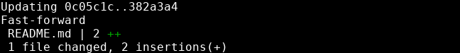

# Git pull
---

We can resynchronize with a branch that's ahead of ours by using ```git pull <branch-name>```

```bash
git pull origin main
```


If we check the log, we see that origin/main and main point to the same commit now.


This means our branch is in sync with its remote!
 
> Using git pull before starting to work on your local branch is a good idea
> 
> If you're working on a big team, you should pull first and pull often
{: .pro-tip}
