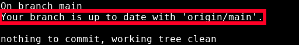
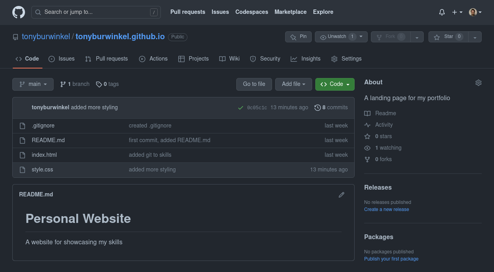
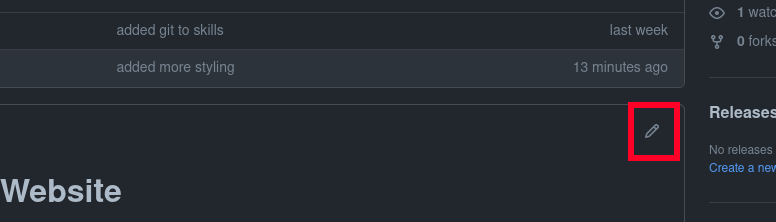
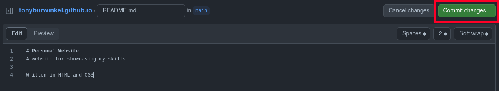
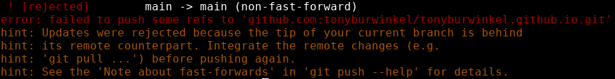

# Remote Repositories

---

Now that we have a remote repo set up, let's run ```git status``` again.



A few things to note about this message.
* If your branch has remote tracking, ```git status``` will tell you about it
* Your main branch is a separate branch from origin/main
* The name "origin/main" means that this branch is the tracking branch for your local "main"
* To synchronize your local main branch with its remote, origin main, you use ```git push```

Let's look at our remote branch on GitHub:



You can actually edit your repo on GitHub if you want. Normally we would prefer to do this in a text editor like VSCode, but for small tweaks editing on GitHub can be convenient. 

You can edit your README by clicking the pencil icon in the top right corner of its border box:


---

I'm going to make a little edit to the README and use the green button to commit those changes.


What's the consequence of this?
* My local branch won't know about these changes to the remote.
* Now the remote branch is ahead of my local branch. 

Here's what our local and remote main branches look like:

main:


origin/main:

If I run ```git push``` again, Git tells me it can't do it:




Git won't let me push my local branch to the origin because it is behind it by one commit.

This is a common issue you will run into when using Git to collaborate. 
Since many software developers all work to update the integrationi branch at once, your local copy of main can fall behind.

Luckily, there is an easy solution to this...
