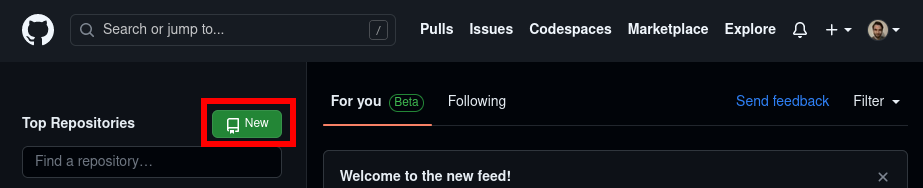
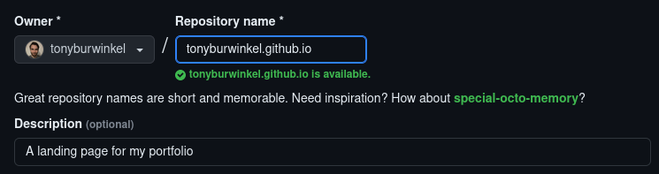
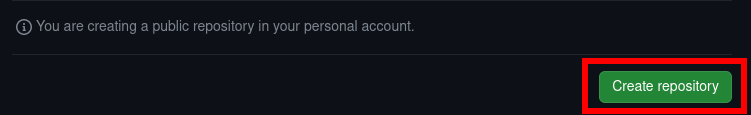
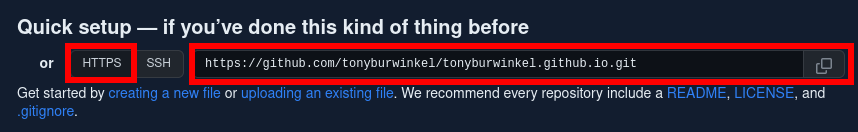
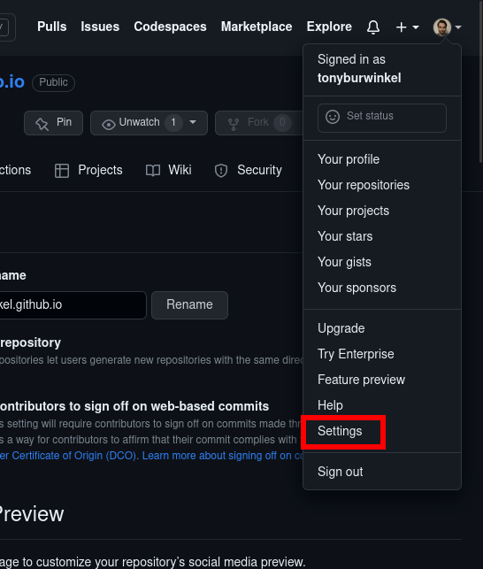
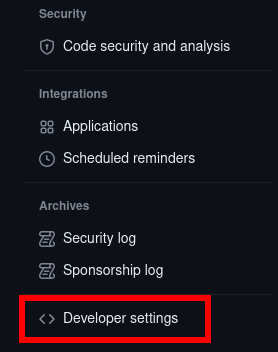
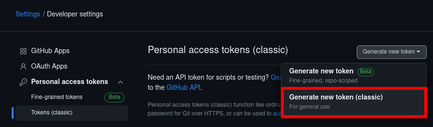
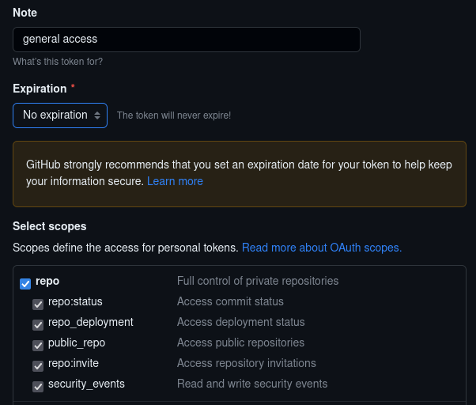
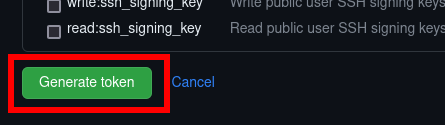

# Setting up our remote

---

In this section, we will be taking our web page and creating a remote tracking repository for it on GitHub.

Setting up remote tracking for your repository has many benefits:
* your work is backed up to the cloud
* you can maintain the repo from multiple machines
* other developers can look at your code
* you can grant permission for other developers to work on your code with you

Go to [GitHub](https://github.com/) and log in to your account.

Click on your profile icon in the upper right hand corner and choose the "Your repositories" option.



In order to make this the landing page for your github account, you must name the repository "\<your username\>.github.io". 

If you'd rather not, just choose another name.



All of the other defaults for the repo should be just fine. Scroll to the bottom of the page and click "Create Repository"



Next, we need to choose an authentication method. For this demonstration, we will use HTTPS. On the page that pops up after creating the repo, choose HTTPS, and copy the link.



Now go to your command line in your repository and type:

```bash
git remote add origin
```

Paste the link after the command. In the terminal, you will need to press Ctrl+Shift+V to paste.

---

Now we need to create an access token. Go to the dropdown menu in the upper right, and choose "Settings".



At the very bottom of the left hand menu, choose "Developer settings":



From the "Personal access tokens" dropdown choose "Tokens (classic)", and on the right hand "Generate new token (classic)"



You must include a note. Choose an expiration date (I chose no expiration), and set the scope to repo.



Now scroll to the bottom and click "Generate token":



Finally! Copy your token to your clipboard. Make sure you do this, as if you leave this page without copying the token you will have to start all over.